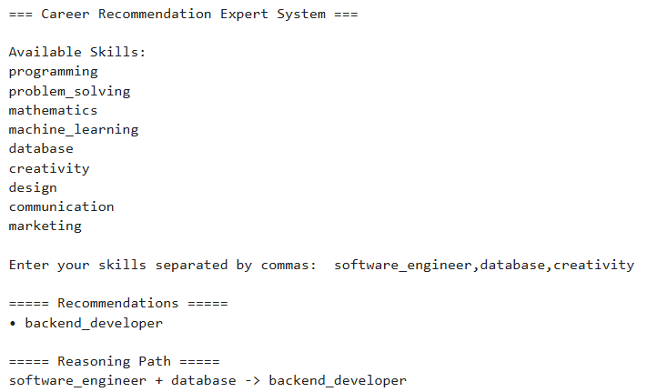
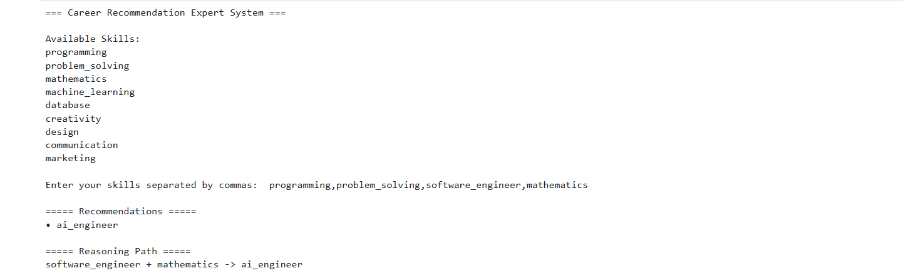

# Career Recommendation Expert System

## Description
A Rule-Based Expert System that recommends career paths based on user skills using Forward Chaining.

## Features
- Rule Engine
- Facts Base
- Multi-Step Inference
- Reasoning Path Logging

## AI Concepts Used
- Expert Systems
- Forward Chaining
- Knowledge Representation

## Example Input
programming,problem_solving,mathematics,machine_learning

## Example Output
software_engineer
ai_engineer
ml_specialist

## Screenshots

### Input Example

### Output Example

